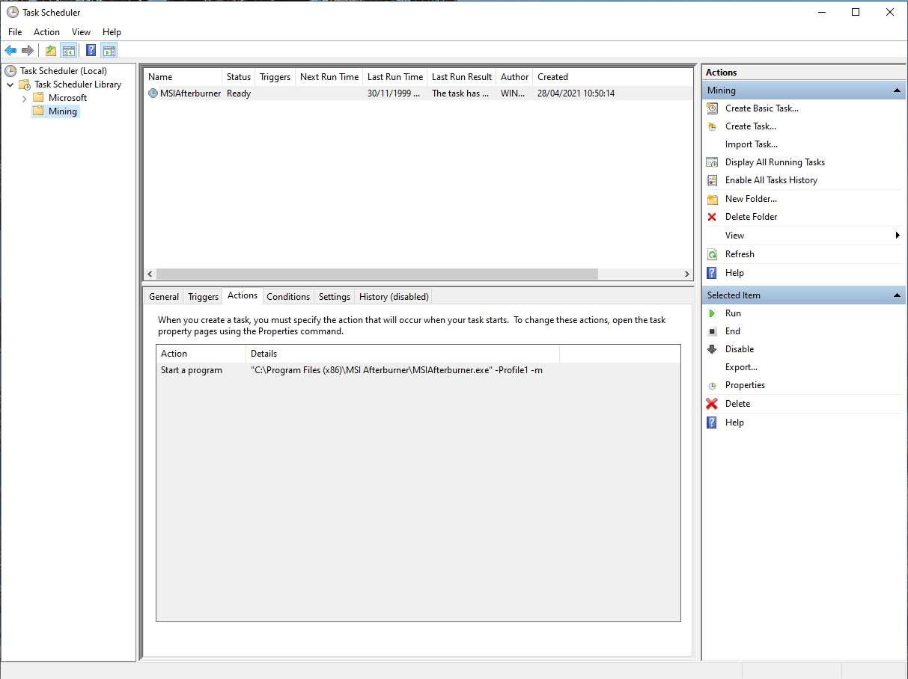
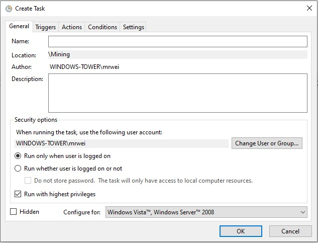
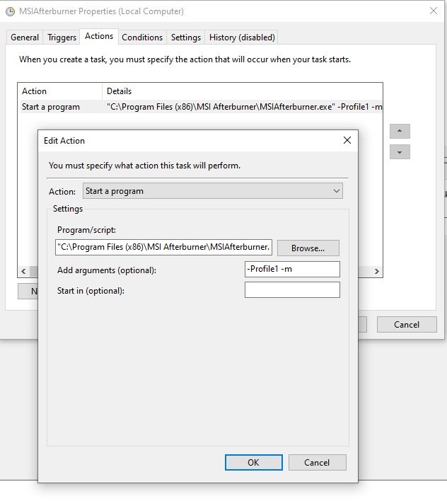

## Windows

We are going to create a **batchfile** which automatically starts MSI Afterburner with **undervolting and overclocking on startup** of windows. This batchfile will make sure that ethminer will be restarted if crashed (connection lost, instable gpu settings). The batchfile can be found in this directory.

### Ethminer

First go to the ethminer github and download the latest [release](https://github.com/ethereum-mining/ethminer/releases).
Extract `ethminer.exe` and the `kernels` folder into `C:\Ethminer`.
You could also choose another location, just make sure to edit the corresponding lines in the batchfile.

(Optional) Ethminer can also be added to [environment varibales](https://superuser.com/questions/284342/what-are-path-and-other-environment-variables-and-how-can-i-set-or-use-them), so that you can run it from anywhere in a terminal.

### MSI Afterburner

Download and install [MSI Afterburner](https://www.msi.com/Landing/afterburner/graphics-cards).
Then you have to lookup the right overlock and undervolt settings for your gpu and save those settings in a profile within MSI Afterburner.
You have to remember in which profile slot you configured your card for later. Here we used **profile1**. Note that when you want to use your gpu (for gaming, ect), you might need to stop ethminer and reset your gpu settings.

Here is an example of the **settings used for a RTX 2070 super**. Baseclock -150, MemoryClock +1000 (**lower this value if instable**), power consumption as low as possible (50%). You should get a reported hashrate around **42MH**.

### Windows task

We have do create a new task in windows so that we can execute MSI Afterburner with privileges. Else windows would always ask if you really want to open MSI Afterburner. This will become very handy when starting MSI Afterburner through the batchfile.

Open the windows programm **Task Scheduler**.
Create a new folder to save your task in the folder. Here we used the name `Mining`.

.

Next create a new task (not basic task). Here we used the name `MSIAfterburner`. You can choose a diffrent name, if so make sure to edit the corresponding lines in the batchfile. Make sure to check the checkbox labeled **Run with highest privileges** like shown.

.

Now go to the **Actions** tab and create a new action **Start a program**.
Browse to where MSI Afterburner is installed and add it. Usually at `C:\Program Files (x86)\MSI Afterburner\MSIAfterburner.exe`.
As argument, use the profile you used to save your config. As we used *Profile1*, our argument looks like this: `-Profile1 -m`.

.

Now we can add the task to the batchfile. This is the command needed `C:\Windows\System32\schtasks.exe /RUN /TN YourFolderName\YourTaskName`. It is located in the second line of the batchfile. Note that you might need to modify your foldername and taskname. Here we used `Mining` and `MSIAfterburner`.

You might want to test the command in a terminal to make sure you made no mistake. You should notice that MSI Afterburner is started with a specific profile active.

## Autostart mining at login

You might want to autologin into your system so that you only need to turn on your computer. Here is a [link](https://docs.microsoft.com/en-us/troubleshoot/windows-server/user-profiles-and-logon/turn-on-automatic-logon) how it can be done.

To autostart the batchfile at login, you need to copy the batchfile to your windows startup folder.
Simply press `windows+r`, enter `shell:startup` and hit enter. Alternatively you can open the folder through **task manager**.
Copy the batchfile into the folder.
You can enable and disable the batchfile and other programs at startup in **task manager** too.

You might also want to have a copy on your Desktop in case you need to restart the batchfile. 

And you're done...happy mining.